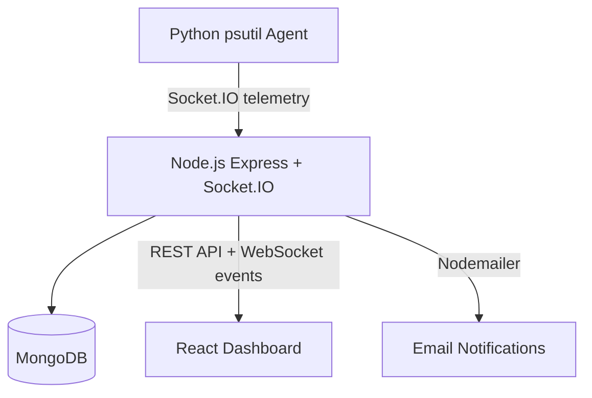

# Sentinel Monitor

Distributed System Resource Monitoring Platform for small teams, labs, and personal infrastructure.

Sentinel Monitor runs a lightweight Python agent on each monitored device, streams telemetry to a Node.js backend over Socket.IO, stores historical metrics in MongoDB, and visualizes fleet health in a React dashboard.

## Features

- Multi-device monitoring for laptops, desktops, VMs, and remote servers.
- Real-time CPU, memory, disk, network, uptime, and top-process telemetry.
- Per-core CPU usage, available memory, free disk, upload/download rates, and total network usage.
- Historical analytics for the last hour, 24 hours, and 7 days.
- Device availability tracking with online/offline status and last-seen timestamps.
- Health score from 0-100 based on CPU, RAM, disk, and availability.
- Configurable CPU, RAM, and disk alert thresholds.
- Alert levels for info, warning, and critical events.
- Email notifications for threshold breaches, offline devices, and reconnect events.

## Architecture



## Tech Stack

- Frontend: React, Vite, Recharts, Socket.IO Client, Tailwind-ready CSS.
- Backend: Node.js, Express, Socket.IO, Mongoose, Nodemailer.
- Database: MongoDB.
- Agent: Python, psutil, python-socketio.

## Getting Started

### Backend

```bash
cd backend
npm install
npm run dev
```

Create `backend/.env` if you need custom settings:

```bash
PORT=4000
CLIENT_ORIGIN=http://localhost:5173
MONGODB_URI=mongodb://127.0.0.1:27017/devops_tracker
DEFAULT_CPU_THRESHOLD=85
DEFAULT_MEMORY_THRESHOLD=90
DEFAULT_DISK_THRESHOLD=95
DEVICE_OFFLINE_AFTER_MS=15000
ALERT_EMAIL_TO=admin@example.com
ALERT_EMAIL_FROM=Sentinel Monitor <alerts@example.com>
SMTP_HOST=smtp.example.com
SMTP_PORT=587
SMTP_SECURE=false
SMTP_USER=user
SMTP_PASS=password
```

For Gmail, use `smtp.gmail.com`, port `587`, `SMTP_SECURE=false`, and a Gmail App Password. A normal account password usually will not work.

### Frontend

```bash
cd frontend
npm install
npm run dev
```

Open the Vite URL, usually `http://localhost:5173`.

### Agent

```bash
cd agent
pip install -r requirements.txt
python agent.py
```

By default the agent connects to `http://localhost:4000` and sends telemetry every 3 seconds.

For another laptop, desktop, VM, or server, point the agent at the central backend:

```bash
set SENTINEL_BACKEND_URL=http://YOUR_BACKEND_IP:4000
set SENTINEL_DEVICE_TYPE=laptop
python agent.py
```

Use `desktop`, `vm`, or `remote-server` for `SENTINEL_DEVICE_TYPE` as needed.
