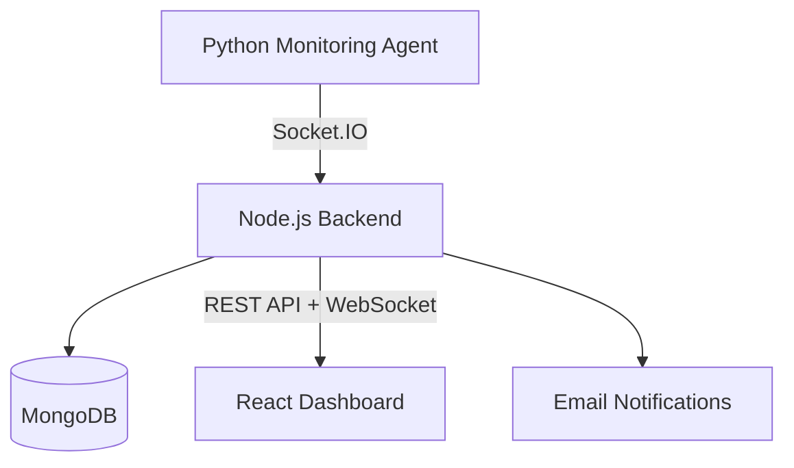

# Sentinel Monitor

> A full-stack distributed system monitoring platform for monitoring laptops, desktops, virtual machines, and remote servers in real time.

🌐 **Live Demo:** https://frontend-ten-ebon-45.vercel.app/  


---

## Features

- 📊 Real-time monitoring of CPU, memory, disk, network, uptime, and running processes.
- 🖥️ Monitor multiple devices from a centralized dashboard.
- 📈 Historical analytics for the last **1 hour**, **24 hours**, and **7 days**.
- 🟢 Live online/offline device status with automatic heartbeat detection.
- ❤️ Intelligent device health score (0–100).
- 🚨 Configurable CPU, memory, and disk usage alerts.
- 📧 Email notifications for:
  - Resource threshold breaches
  - Device offline events
  - Device reconnection events
- 🔄 Real-time updates powered by Socket.IO.
- 🔍 Interactive charts and system metrics dashboard.

---

## Architecture



---

## Tech Stack

### Frontend
- React
- Vite
- Recharts
- Socket.IO Client

### Backend
- Node.js
- Express.js
- Socket.IO
- MongoDB
- Mongoose
- Nodemailer

### Monitoring Agent
- Python
- psutil
- python-socketio

### Deployment
- Vercel (Frontend)
- Render (Backend)
- MongoDB Atlas

---


### Clone

```bash
git clone https://github.com/anshmishra07/Sentinel-v1.git
cd Sentinel-v1
```

---

### Backend

```bash
cd backend
npm install
npm run dev
```

Create a `.env` file:

```env
PORT=4000
CLIENT_ORIGIN=http://localhost:5173

MONGODB_URI=your_mongodb_connection_string

DEFAULT_CPU_THRESHOLD=85
DEFAULT_MEMORY_THRESHOLD=90
DEFAULT_DISK_THRESHOLD=95

DEVICE_OFFLINE_AFTER_MS=15000

ALERT_EMAIL_TO=your_email@example.com
ALERT_EMAIL_FROM=Sentinel Monitor <alerts@example.com>

RESEND_API_KEY=your_resend_api_key
```

---

### Frontend

```bash
cd frontend
npm install
npm run dev
```

---

### Agent

Install dependencies:

```bash
cd agent
pip install -r requirements.txt
```

Run locally:

```bash
python agent.py
```

To connect to a deployed backend:

```bash
set SENTINEL_BACKEND_URL=https://YOUR_RENDER_BACKEND.onrender.com
set SENTINEL_DEVICE_TYPE=laptop
python agent.py
```

Supported device types:

- laptop
- desktop
- vm
- remote-server

---

## Deployment

### Frontend

Deploy on **Vercel**.

### Backend

Deploy on **Render**.

Configure:

```env
CLIENT_ORIGIN=https://frontend-ten-ebon-45.vercel.app
```

---


## Future Improvements

- Authentication & user accounts
- Docker deployment
- Kubernetes support
- Prometheus integration
- Mobile responsive dashboard
- Slack & Discord alert integrations
- Agent auto-updater

---

## License

MIT License.
